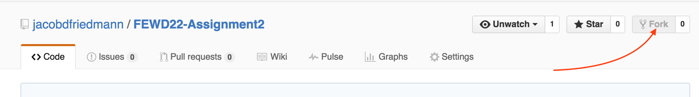
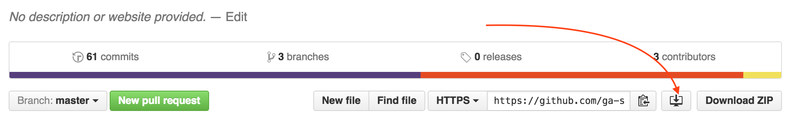
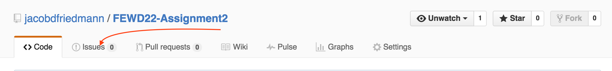
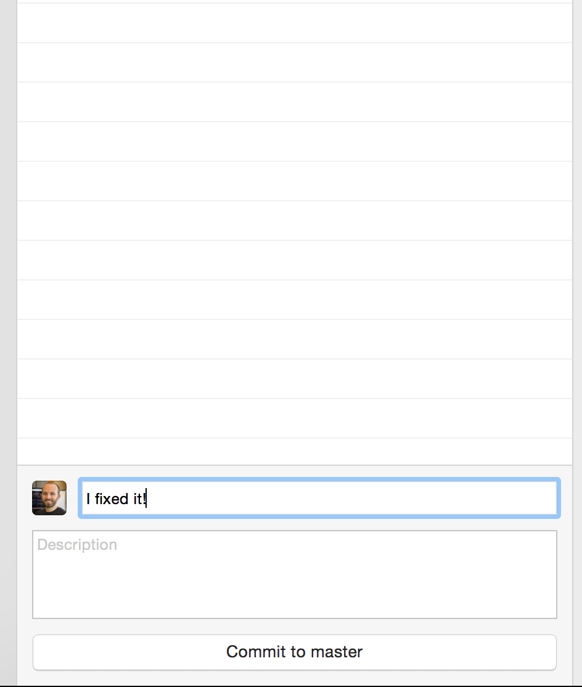
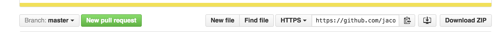
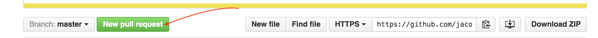

#FEWD Week #2: Tools

##Please Help Me

Hello, my name is Todd. I love FEWD, but I'm struggling. Can you help me fix my site?

###Description

Your assignment this week is to demonstrate your ability to use GitHub workflows. You will help Todd fix his first website by forking, fixing the issue, and submitting a pull request.

###Real-World Applications

- Using GitHub to contribute to projects
- Use an HTML validator to verify valid HTML
- Debug basic HTML and CSS issues

---

###Technical Requirements

- Fix broken css `<link>` tag
- Fix invalid HTML
- Add valid `<meta>` tags
- Remove bullets from `<ul>` list
- Fix the text color for the page
- Submit a pull request with all of these changes
- Explain in the pull request how you fixed each issue

---

###Resources

- Slides from [class 3](http://ga-students.github.io/FEWD-DC-22/Week_02_Tools/03_tools/index.html).
- [HTML Validator](https://validator.w3.org)

---

###Submission

1. Fork this repository

2. Clone **YOUR FORK** to the GitHub Desktop app

3. Look at the "issue" on GitHub.

4. Fix the "issue"
5. Commit your changes.

6. Push your changes to your fork on GitHub.

7. Create a pull request for your fixes.

8. In your pull request description, explain how you fixed each issue.

###Evaluation

The instructional team will grade each technical requirement and provide a numeric grade on a scale: does not meet expectations (0); meets expectations (1); exceeds expectations (2).  The maximum possible score on this assignment is 14/14.

